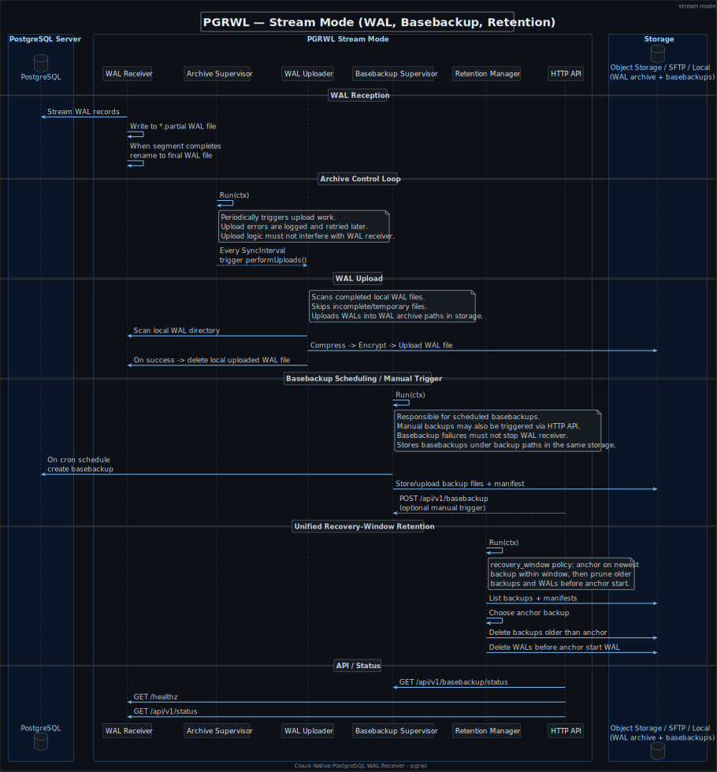

# pgrwl

> Cloud-native continuous backup for PostgreSQL in a single binary.

[](https://github.com/pgrwl/pgrwl/blob/master/LICENSE)
[](https://goreportcard.com/report/github.com/pgrwl/pgrwl)
[](https://pkg.go.dev/github.com/pgrwl/pgrwl)
[](https://github.com/pgrwl/pgrwl/actions/workflows/ci.yml?query=branch:master)
[](https://github.com/pgrwl/pgrwl/issues)
[](https://github.com/pgrwl/pgrwl/blob/master/go.mod#L3)
[](https://github.com/pgrwl/pgrwl/releases/latest)
[](https://github.com/pgrwl/pgrwl/issues?q=is%3Aissue+is%3Aopen+sort%3Aupdated-desc+label%3A%22good+first+issue%22)

**pgrwl** is a Go-based PostgreSQL backup tool for continuous WAL archiving and scheduled base backups. It streams
PostgreSQL WALs and base backups into local or remote storage, with optional compression, encryption, retention, and
monitoring built in.

It is designed for disaster recovery and PITR (Point-in-Time Recovery), with a focus on low operational complexity:
no extra backup tools, no external schedulers, and no dependency chain to operate - just one binary, PostgreSQL, and
your chosen storage backend.

For WAL streaming, `pgrwl` behaves as a container-friendly alternative to `pg_receivewal`, supporting streaming
replication, automatic reconnects, partial WAL files, archive upload, retention, and restore integration.

---

## Table of Contents

- [Overview](#overview)
- [Quick Start](#quick-start)
- [Installation](docs/pgrwl/installation.md) - binary, Docker, Helm, Debian/Alpine packages
- [Configuration Reference](docs/pgrwl/configuration.md) - full YAML/JSON schema and env-var mapping
- [REST API](docs/pgrwl/rest-api.md)
- [Disaster Recovery Use Cases](#disaster-recovery-use-cases)
- [Architecture](#architecture)
    - [Design Notes](#design-notes)
    - [Durability \& `fsync`](#durability--fsync)
    - [Why Not `archive_command`?](#why-not-archive_command)
- [Contributing](CONTRIBUTING.md)
- [Links](docs/pgrwl/links.md)
- [License](#license)

---

## Overview

Reliable PostgreSQL backups come with moving parts: WAL handling, scheduled jobs, compression, remote storage,
and retention - each one more thing to configure, monitor, and debug.

`pgrwl` replaces that entire stack with a single process: WAL streaming, scheduled base backups,
compression, encryption, S3/SFTP upload, retention management, and a restore helper - all driven
by one config file.

It implements the streaming replication protocol directly (not `archive_command`), which means
it supports replication slots, `*.partial` WAL files, and synchronous replication acknowledgment -
enabling **RPO=0** in high-durability setups.

**Basic dashboard**


**Architecture**



---

## Quick Start

```sh
# Install
curl -fsSL https://raw.githubusercontent.com/pgrwl/pgrwl/master/scripts/install.sh | sh

# Start PostgreSQL with replication enabled
cat >docker-compose.yml <<'EOF'
services:
  pg:
    image: postgres:17.9-bookworm
    environment:
      POSTGRES_PASSWORD: postgres
    ports: ["15432:5432"]
    command: >
      postgres
      -c wal_level=replica
      -c max_wal_senders=10
      -c max_replication_slots=10
      -c listen_addresses=*
      -c hba_file=/etc/postgresql/pg_hba.conf
    configs:
      - source: pg_hba.conf
        target: /etc/postgresql/pg_hba.conf
        mode: "0755"
configs:
  pg_hba.conf:
    content: |
      local all         all     trust
      local replication all     trust
      host  all         all all trust
      host  replication all all trust
EOF
docker compose up -d

# Configure and run pgrwl
cat >config.yml <<'EOF'
main:
  listen_port: 7070
  directory: wals
receiver:
  slot: pgrwl_v5
  uploader:
    sync_interval: 15s
    max_concurrency: 2
backup:
  cron: "* * * * *"
EOF

PGHOST=localhost PGPORT=15432 PGUSER=postgres PGPASSWORD=postgres \
    pgrwl daemon -c config.yml
```

**More examples**

- [Kubernetes (S3, UI, metrics)](https://github.com/pgrwl/pgrwl/tree/master/examples/k8s-quick-start)
- [Docker Compose (S3, UI)](docs/pgrwl/docker-compose-quick-start.md)

---

## Disaster Recovery Use Cases

- In production, `pgrwl` runs in **receive mode** as the main backup and archiving daemon.

- It continuously streams WAL from PostgreSQL, writes in-progress segments as `*.partial` files,
  and renames them to final WAL filenames when complete.
  Completed WAL files are then archived by the archive supervisor: optionally compressed,
  encrypted, uploaded to the configured backend, and removed locally after a successful upload.

- `pgrwl` also creates scheduled full base backups, for example _once every three days_.
  Base backups can also be triggered manually through the HTTP API.
  Backup failures are logged and reported, but they do not stop WAL streaming,
  because WAL capture is the critical path.

- WAL files and base backups are stored in the same configured backend, such as **S3**, **SFTP**,
  or local storage, but under separate logical prefixes.

- Retention is handled by a single **recovery-window policy**. `pgrwl` selects an **anchor backup**:
  the newest successful basebackup that started before the recovery window begins.
  It keeps that backup, all newer successful backups, and all WAL files
  required to restore forward from the anchor backup.

- For example, with a **72-hour recovery window**, `pgrwl` keeps enough
  basebackup and WAL history to recover to any point in the last three days.

- During recovery, `pgrwl` runs in **serve mode**. PostgreSQL calls `pgrwl restore-command`
  from `restore_command`; the helper fetches requested WAL files from the restore daemon
  and writes them to the path expected by PostgreSQL.
  **Serve mode** exposes local `*.partial` WAL files from the receiver's `ReadWriteOnce` PVC.
  This follows the main design rule: **always stream WAL to the local filesystem first**, so recovery
  can use the latest committed WAL records even if they were not archived yet.

  ```ini
  # postgresql.conf
  restore_command = 'pgrwl restore-command --addr=<host>:<port> %f %p'
  ```

This allows a crashed cluster to be restored to any point covered by the configured recovery window.

---

## Architecture

### Design Notes

`pgrwl` is designed to **always stream WAL data to the local filesystem first**. This design ensures durability and
correctness, especially in synchronous replication setups where PostgreSQL waits for the replica to confirm the commit.

- Incoming WAL data is written directly to `*.partial` files in a local directory.
- These `*.partial` files are synced (`fsync`) after each write to ensure that WAL segments are fully durable on disk.
- Once a WAL segment is fully received, the `*.partial` suffix is removed, and the file is considered complete.

**Compression and encryption** are applied only after a WAL segment is completed:

- Completed files are passed to the uploader worker, which may compress and/or encrypt them before uploading to a remote
  backend (e.g., S3, SFTP).
- The uploader worker **ignores partial files** and operates only on finalized, closed segments.

This model avoids the complexity and risk of streaming incomplete WAL data directly to remote storage, which can lead to
inconsistencies or partial restores. By ensuring that all WAL files are locally durable and only completed files are
uploaded, `pgrwl` guarantees restore safety and clean segment handoff for disaster recovery.

In short: **PostgreSQL requires acknowledgments for commits in synchronous setups**, and relying on external systems for
critical paths (like WAL streaming) could introduce unacceptable delays or failures. This architecture mitigates that
risk.

### Durability & `fsync`

- After each WAL segment is written, an `fsync` is performed on the currently open WAL file to ensure durability.
- An `fsync` is triggered when a WAL segment is completed and the `*.partial` file is renamed to its final form.
- An `fsync` is triggered when a keepalive message is received from the server with the `reply_requested` option set.
- Additionally, `fsync` is called whenever an error occurs during the receive-copy loop.

### Why Not `archive_command`?

There’s a significant difference between using `archive_command` and archiving WAL files via the streaming replication
protocol.

The `archive_command` is triggered only after a WAL file is fully completed-typically when it reaches 16 MiB (the
default segment size). This means that in a crash scenario, you could lose up to 16 MiB of data.

You can mitigate this by setting a lower `archive_timeout` (e.g., 1 minute), but even then, in a worst-case scenario,
you risk losing up to 1 minute of data.
Also, it’s important to note that PostgreSQL preallocates WAL files to the configured `wal_segment_size`, so they are
created with full size regardless of how much data has been written. (Quote from documentation:
_It is therefore unwise to set a very short `archive_timeout` - it will bloat your archive storage._).

In contrast, streaming WAL archiving-when used with replication slots and the `synchronous_standby_names`
parameter-ensures that the system can be restored to the latest committed transaction.
This approach provides true zero data loss (**RPO=0**), making it ideal for high-durability requirements.

---

## License

MIT. See [LICENSE](./LICENSE) for details.
